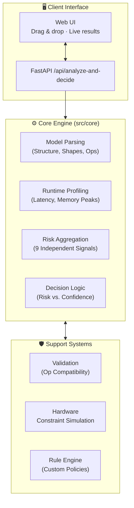

# Portolio Release Ready

**STATUS**: `PORTFOLIO_RELEASE_READY`

## Project Summary
The **AI Deployment Decision Engine** is a deterministic, signal-driven framework operating at the boundary of machine learning and system constraints. Its objective is simple but critical: evaluate whether an ML model can safely run on target hardware environments (EDGE, STANDARD, PRODUCTION, HPC) before it reaches production.

Unlike heuristic or manual approaches to deployment, this engine extracts model properties, performs synthetic profiling, subjects the measurements to hardware constraints, and computes 9 distinct risk signals (memory, CPU, GPU presence, latency guarantees, drift, and structural security). The output is a clear, explainable, authoritative decision: **ALLOW**, **ALLOW WITH CONDITIONS**, or **BLOCK**.

This repository is built as a highly structured, scalable software enterprise project demonstrating architecture design, determinism, ML ops principles, and professional testing.

## Author Attribution
**Author:** Omar Nady \
**Year:** 2026 \
**Purpose:** Public Portfolio Demonstration

## Architecture



## Key Features
- **Stateless & Deterministic:** Identical model and hardware profile inputs always yield bit-for-bit identical decision reports and risk scores.
- **Explainable AI Deployment:** 0–10 risk scores are generated out of 9 configurable sub-signals; every report details exactly why a decision was reached.
- **Hardware Profile Mapping:** Evaluates capability margins (not just minimum specs) for Edge, Standard, Production, and HPC scaling scenarios.
- **Validation Engine:** Automatically checks operator compatibility against target runtimes before simulated execution.
- **Concurrency Safe:** Architecture is perfectly safe for multi-worker API clusters responding to parallel analysis requests.

## How to Run

Running the engine requires `Python 3.9+`.

1. **Install Requirements:**
   ```bash
   pip install fastapi uvicorn onnxruntime numpy
   ```

2. **Launch Web Server:**
   ```bash
   python main.py --gui
   ```

3. **Access Interface:** 
   Navigate your browser to `http://127.0.0.1:8080`.

## License
Provided under the **Portfolio Research License**. The code may be viewed and evaluated for educational / hiring purposes but commercial use, redistribution, and derivative product creation is strictly prohibited without written consent from the author.
