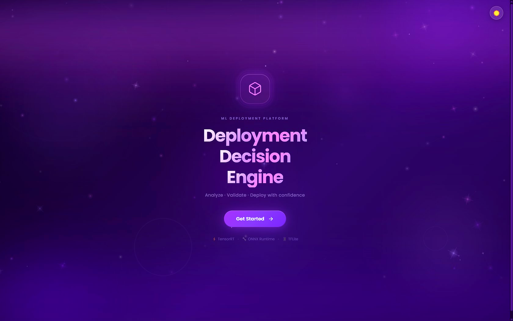
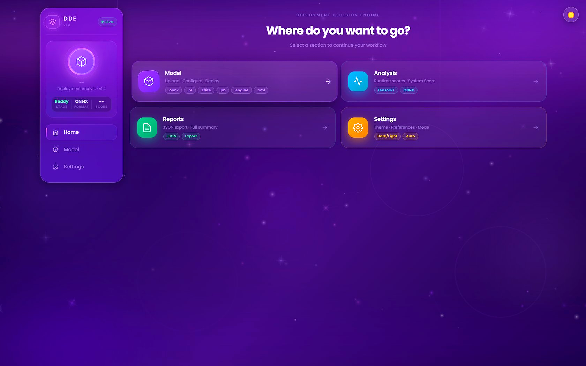
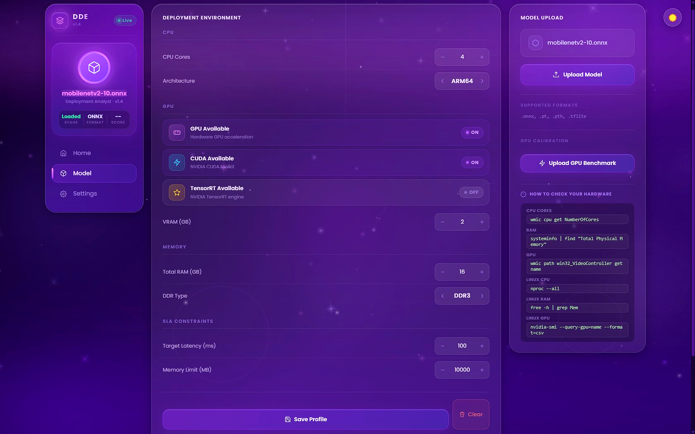
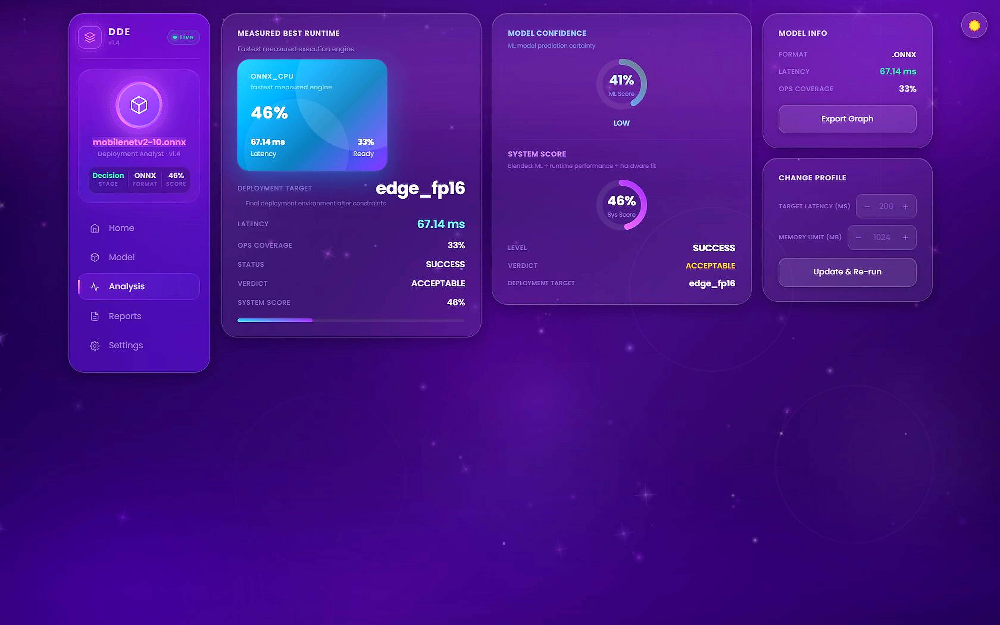
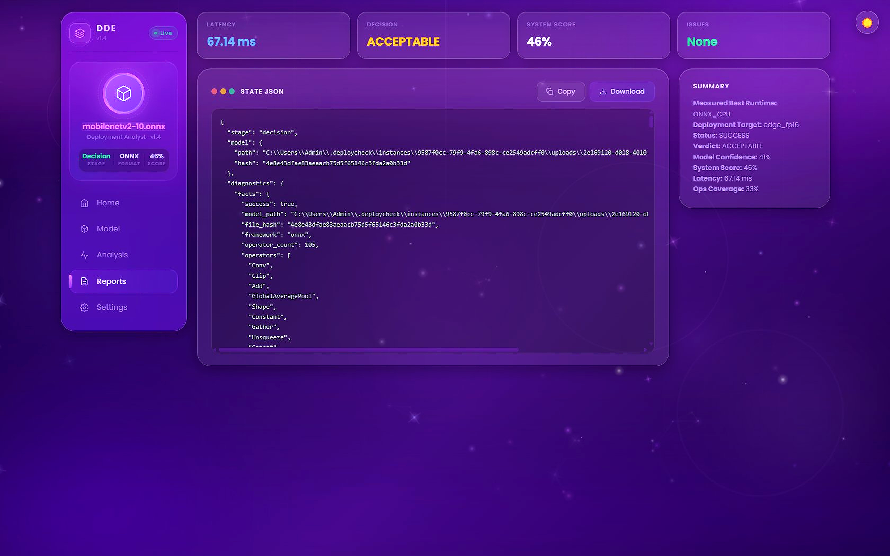
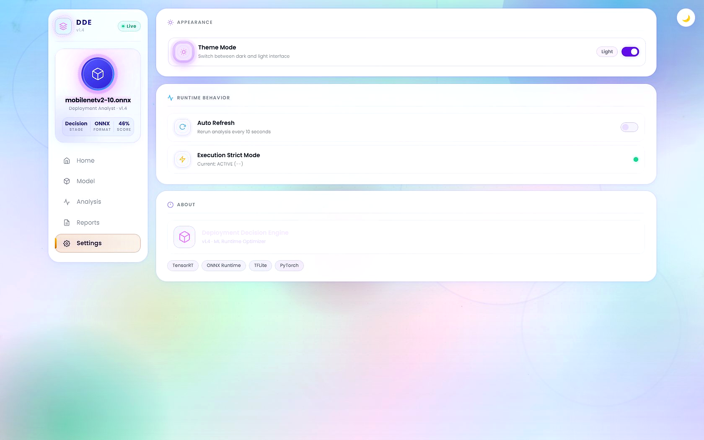

# Deployment Decision Engine (DDE)

**Analyze · Validate · Deploy with Confidence**

DDE is a Python-native ML deployment analyst. Upload your model, describe your hardware, and get a single actionable verdict: which runtime to use, where to deploy it, and whether it's safe to ship.


---

## Screenshots

| Splash | Home |
|--------|------|
|  |  |

| Model & Hardware Config | Analysis Results |
|------------------------|-----------------|
|  |  |

| Reports | Settings |
|---------|----------|
|  |  |

---

## How It Works

```
┌─────────────────────────────────────────────────────────────────┐
│                        DDE Pipeline                             │
│                                                                 │
│   Upload Model          Benchmark               Decide          │
│  ┌──────────┐        ┌───────────────┐       ┌──────────────┐  │
│  │ .onnx    │        │  ONNX_CPU     │       │  ML Model    │  │
│  │ .pt/.pth │──────▶ │  ONNX_CUDA   │──────▶│  (sklearn)   │  │
│  │ .tflite  │        │  TENSORRT     │       │              │  │
│  └──────────┘        │  TORCH        │       └──────┬───────┘  │
│                      │  TFLITE       │              │          │
│   Hardware Profile   └───────────────┘              ▼          │
│  ┌──────────┐                               ┌──────────────┐   │
│  │ CPU/GPU  │──────────────────────────────▶│  Verdict     │   │
│  │ RAM/VRAM │                               │  + Score     │   │
│  │ SLA/DDR  │                               │  + Target    │   │
│  └──────────┘                               └──────────────┘   │
└─────────────────────────────────────────────────────────────────┘
```

### Pipeline Stages

The backend enforces a strict state machine — each stage must complete before the next begins:

```
empty  →  model  →  diagnostics  →  analysis  →  decision
```

| Stage | What happens |
|-------|-------------|
| `model` | File saved, ONNX graph parsed, hash computed |
| `diagnostics` | Operator scan, unsupported-op rules evaluated |
| `analysis` | Runtimes benchmarked, scores computed |
| `decision` | ML model predicts deployment target + confidence |

### Deployment Targets

| Target | Where & How |
|--------|------------|
| `edge_int8` | Low-power edge device — INT8 quantised |
| `edge_fp16` | Edge device — FP16 precision |
| `cloud_cpu` | Server-side CPU inference |
| `cloud_gpu` | Server-side GPU inference (CUDA / TensorRT) |

### Verdict Confidence

| Level | Score | Action |
|-------|-------|--------|
| `HIGH` | ≥ 0.80 | Deploy with standard monitoring |
| `MEDIUM` | 0.50–0.79 | Review WARN diagnostics first |
| `LOW` | < 0.50 | Manual review recommended |

---

## Quickstart

### Prerequisites

- Python ≥ 3.9

### Install & Run

```bash
git clone https://github.com/your-org/DDE.git
cd DDE
pip install --no-cache-dir -r requirements.lock

# Start the web UI
python -m uvicorn src.api.gui_app:app --host 127.0.0.1 --port 8080
```

Open **http://127.0.0.1:8080** in your browser.

> ⚠️ **Single-worker only.** DDE uses an in-process state store — do **not** pass `--workers N > 1`.

### CLI (no UI)

```bash
python main.py <model_path> [OPTIONS]

# Example
python main.py mobilenetv2-10.onnx --profile my_hardware.json
```

| Flag | Description |
|------|-------------|
| `--profile PATH` | Hardware profile JSON |
| `--show-trust` | Print OOD trust metrics |
| `--dry-run` | Skip calibration writes (safe for CI) |

**CLI exit codes:** `0` Approved · `1` Blocked · `2` Conditional · `3` Pipeline error · `4` Uncertain

---

## Docker

```bash
make pin-digest   # pin base image (run once)
make build        # build image
docker run --rm -p 8080:8080 dde:latest
```

---

## Project Structure

```
DDE/
├── main.py                   ← CLI entry point
├── src/
│   ├── api/                  ← FastAPI app + route handlers
│   ├── core/
│   │   ├── runtime/          ← ONNX, TensorRT, TFLite, Torch evaluators
│   │   ├── scoring/          ← Confidence + utility scoring
│   │   ├── ml_decision_engine.py  ← Loads & runs the sklearn model
│   │   └── feature_extractor.py   ← Model facts + HW profile → feature vector
│   ├── services/             ← Benchmark, upload, hardware profiler
│   ├── training/             ← Dataset collection + training helpers
│   └── gui/static/           ← Single-page UI (index.html + app.js)
├── model_bundle_v1/          ← Production sklearn model (~5 MB)
├── model_bundle_v2/          ← Populated after retraining
├── training/                 ← Standalone training scripts
├── tests/golden/             ← Golden baseline regression tests
├── Dockerfile
└── Makefile
```

---

## API Reference

Base URL: `http://127.0.0.1:8080` · Interactive docs: `/docs`

| Method | Path | Description |
|--------|------|-------------|
| `GET` | `/api/health` | Liveness check |
| `GET` | `/api/state` | Full in-memory state snapshot |
| `GET` | `/api/capabilities` | Available runtimes on this server |
| `POST` | `/api/model/index` | Upload a model file |
| `POST` | `/api/deployment/profile` | Save hardware + SLA profile |
| `POST` | `/api/model/analyze` | Run runtime benchmarks |
| `POST` | `/api/analyze-and-decide` | Full pipeline in one call |
| `GET` | `/api/decision/history` | Past decision records |

---

## Retraining the Decision Model

```bash
# 1. Build dataset from telemetry
python training/build_dataset_from_telemetry.py

# 2. (Optional) Generate synthetic data
python training/data_generator.py

# 3. Train
python training/train_decision_model.py

# 4. Smoke test
make test-v2-smoke
```

Output lands in `model_bundle_v2/`. Never modify an existing bundle — increment to `v3/` instead.

---

## Testing

```bash
pytest tests/golden/ -v   # golden baseline tests
make ci                   # full CI pipeline
```

---

## License

MIT — see [LICENSE](LICENSE) for details.
