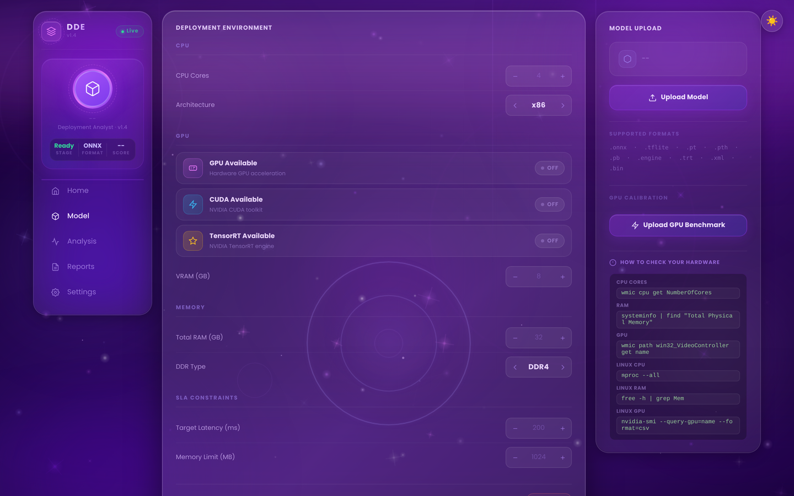
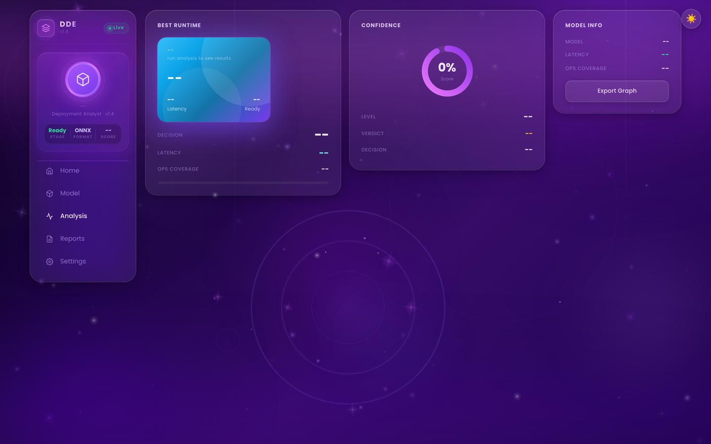
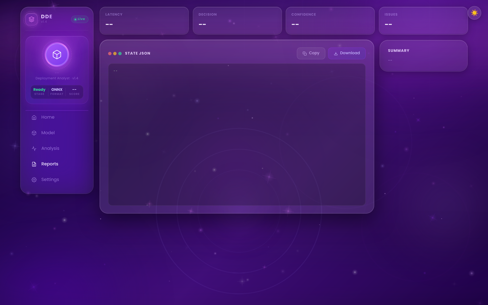

# AI Deployment Decision Engine

A system that analyzes machine learning models and determines whether they can be safely deployed on a given hardware environment using runtime simulation and risk scoring.

---

## Table of Contents

1. [Project Overview](#project-overview)
2. [Key Features](#key-features)
3. [Screenshots](#screenshots)
4. [System Architecture](#system-architecture)
5. [Core Components](#core-components)
6. [Hardware Profiles](#hardware-profiles)
7. [Risk Model](#risk-model)
8. [Decision System](#decision-system)
9. [Project Structure](#project-structure)
10. [Running the Project](#running-the-project)
11. [Experiment Validation](#experiment-validation)
12. [License](#license)

---

## Project Overview

The **AI Deployment Decision Engine** is an automated model assessment system that evaluates whether a machine learning model can be safely and reliably deployed onto a target hardware environment. Engineers submit a model and receive a structured deployment decision backed by measurable signals and reproducible scoring — replacing informal compatibility reviews with a consistent, auditable protocol.

The system operates as a **deployment gate**: a policy-enforcing layer positioned between model development and production infrastructure. Every model must pass through the engine before it is authorized for deployment. The engine does not assume suitability; it verifies it.

Deploying a model without rigorous compatibility checks introduces operational risk. Undersized hardware produces latency violations. Overlooked memory constraints cause runtime failures. Security gaps in inference pipelines create exploitable surfaces. This engine makes deployment decisions **systematic, auditable, and repeatable** — converting a multi-variable compatibility problem into a deterministic, signal-driven verdict with full signal-level traceability.

---

## Key Features

- **ONNX model structural analysis** — Static graph parsing with operator-level breakdown and parameter quantification
- **Runtime performance simulation** — Simulation-based latency, throughput, and memory estimation without requiring physical hardware
- **Hardware profile evaluation** — Four standardized tiers: Edge, Standard, Production, and HPC
- **Risk scoring engine** — Nine-signal normalized scoring with configurable per-signal weights
- **Deterministic deployment decisions** — Threshold-based policy mapping; identical inputs always produce identical outputs
- **Confidence estimation** — Per-decision reliability scoring that quantifies uncertainty in the analysis
- **FastAPI backend** — Concurrent-safe `/analyze` endpoint with structured JSON responses
- **Web UI interface** — Browser-based submission, result visualization, and report export
- **Concurrency-safe analysis** — No shared mutable state; safe under concurrent API load
- **Validation experiment harness** — Scripted suite verifying risk scaling, confidence variation, determinism, and concurrency correctness

---

## Screenshots

> All screenshots were captured from the live UI at 2× device pixel ratio (2880 × 1800 effective resolution).

### Dashboard

The engine opens on an animated splash screen listing supported inference runtimes. Click **Get Started** to enter the main application shell, which presents the four workflow modules: Model, Analysis, Reports, and Settings.


### Model Upload

The **Model** tab combines the upload interface with the full hardware environment configuration panel. Engineers upload an ONNX model, configure CPU cores, architecture (x86 / ARM / ARM64 / RISC-V), GPU and CUDA availability, VRAM, total RAM, DDR type, and SLA constraints including target latency and memory limits — all in one view.



### Hardware Profile Configuration

The **Analysis** tab displays the runtime assessment output once a model has been submitted. Cards show the Best Runtime recommendation with latency and readiness indicators, a Confidence score ring, and a Model Info panel with operator coverage metrics and graph export capability.



### Analysis Results

The **Reports** tab presents the final deployment output: Latency, Decision, Confidence, and Issues header tiles above a STATE JSON viewer with one-click Copy and Download. The full machine-readable report is available for pipeline integration or archival.



---

## System Architecture

The engine processes model submissions through a sequential pipeline of specialized components. Each layer transforms raw model data into a higher-level signal until a final deployment decision is produced.

```
                        ┌─────────────────────┐
                        │        User         │
                        │  (Browser / API)    │
                        └──────────┬──────────┘
                                   │
                                   ▼
                        ┌─────────────────────┐
                        │      Web UI         │
                        │  (FastAPI + HTML)   │
                        └──────────┬──────────┘
                                   │
                                   ▼
                        ┌─────────────────────┐
                        │   FastAPI Backend   │
                        │  /analyze endpoint  │
                        └──────────┬──────────┘
                                   │
                                   ▼
                        ┌─────────────────────┐
                        │  Model Analysis     │
                        │     Engine          │
                        │  (ONNX graph parse) │
                        └──────────┬──────────┘
                                   │
                                   ▼
                        ┌─────────────────────┐
                        │  Runtime Profiler   │
                        │  (latency / memory) │
                        └──────────┬──────────┘
                                   │
                                   ▼
                        ┌─────────────────────┐
                        │    Risk Engine      │
                        │  (signal scoring)   │
                        └──────────┬──────────┘
                                   │
                                   ▼
                        ┌─────────────────────┐
                        │   Decision Layer    │
                        │  (risk → verdict)   │
                        └──────────┬──────────┘
                                   │
                                   ▼
                        ┌─────────────────────┐
                        │  Deployment Report  │
                        │  (JSON + UI output) │
                        └─────────────────────┘
```

A user submits a model through the browser UI or REST API. The FastAPI backend routes the submission into the pipeline, where the Model Analysis Engine performs static graph inspection, the Runtime Profiler simulates execution against the specified hardware tier, and the Risk Engine aggregates nine normalized signals into a composite score. The Decision Layer maps that score to a policy verdict, and the complete result is serialized into a structured Deployment Report returned to the caller.

### Pipeline Layer Reference

| Layer | Responsibility |
|---|---|
| **Web UI** | Browser-based interface for submitting models and reviewing results. Renders analysis reports and decision verdicts. |
| **FastAPI Backend** | Exposes the `/analyze` REST endpoint. Handles request validation, routes submissions into the pipeline, and returns structured JSON responses. |
| **Model Analysis Engine** | Parses ONNX model graphs. Identifies operators, measures node count, quantifies parameter density, and flags unsupported operations for the target runtime. |
| **Runtime Profiler** | Simulates model execution against a specified hardware profile. Estimates per-layer latency, peak memory usage, and I/O throughput requirements. |
| **Risk Engine** | Receives profiling output and hardware profile metadata. Aggregates multiple risk signals into a single normalized composite score on a 0–10 scale. |
| **Decision Layer** | Applies the risk score to a threshold-based policy table. Emits one of three deployment verdicts: `ALLOW`, `ALLOW_WITH_CONDITIONS`, or `BLOCK`. |
| **Deployment Report** | Serializes the complete analysis result — including per-signal breakdowns, confidence level, hardware tier, and final decision — into a structured report delivered via the API and rendered in the UI. |

---

## Core Components

### `pipeline.py` — Orchestration Pipeline

The top-level controller for the analysis workflow. Accepts a model path and hardware profile identifier as inputs. Instantiates each downstream module in sequence, passes intermediate results between stages, and aggregates outputs into the final deployment report object. All error handling and logging is centralized here.

### `model_analysis.py` — ONNX Graph Analysis

Loads an ONNX model from disk and performs static graph analysis. Extracts operator types and frequencies, node count and depth, parameter tensor shapes and sizes, dynamic shape indicators, and the presence of custom or non-standard operators that may lack runtime support. Produces a structured `ModelProfile` dataclass consumed by downstream components.

### `runtime_profiler.py` — Execution Profiling

Accepts a `ModelProfile` and a `HardwareProfile` as inputs. Uses operator-level latency tables and memory bandwidth models to estimate inference latency (ms per forward pass), peak memory allocation (MB), sustained throughput (inferences per second), and I/O pressure (read/write bandwidth demands). Profiling is simulation-based and does not require physical hardware. Results are reproducible given the same model and hardware tier inputs.

### `framework_adapter.py` — Inference Runtime Adapter

Abstracts differences between inference runtimes (ONNX Runtime, TensorFlow Lite, PyTorch, TensorRT). Maps model operators to runtime-specific execution paths and identifies compatibility gaps. Provides the risk engine with a `CompatibilityReport` indicating which operators are natively supported, which require fallback kernels, and which are unsupported on the target runtime.

### `risk_engine.py` — Risk Signal Aggregation

The core scoring module. Accepts profiling results, hardware specifications, compatibility reports, and environmental signals. Normalizes each signal to a 0–1 range, applies configurable per-signal weights, and computes a weighted composite risk score in the range [0.0, 10.0]. See the [Risk Model](#risk-model) section for signal definitions and weighting logic.

### `decision.py` — Deployment Decision Mapper

Applies a threshold policy to the composite risk score. Produces a `DeploymentDecision` with three possible values: `ALLOW`, `ALLOW_WITH_CONDITIONS`, or `BLOCK`. When the decision is `ALLOW_WITH_CONDITIONS`, the module also generates a list of specific, actionable remediation conditions that must be satisfied before deployment proceeds.

### `confidence.py` — Decision Confidence Estimation

Estimates the reliability of the risk score and deployment decision. Confidence is reduced by high variance across individual signal scores, limited operator coverage data for the target hardware, the presence of dynamic shapes that were not fully resolvable at analysis time, and unusual model architectures with limited profiling history. Outputs a `ConfidenceLevel` (`HIGH`, `MEDIUM`, `LOW`) and a numerical confidence percentage attached to the final deployment report.

---

## Hardware Profiles

The engine evaluates deployment feasibility across four standardized hardware tiers. Each tier defines a specification envelope against which the model's resource requirements are compared. The engine also evaluates **margin** — deployments that consume more than 85% of a tier's resources in any single dimension are treated as elevated risk, even if they nominally fit within the limits.

| Tier | Label | Description | Typical Use Case |
|---|---|---|---|
| 1 | `EDGE` | Low-power embedded or mobile devices. Constrained CPU, limited RAM, no discrete GPU. | IoT sensors, on-device mobile inference |
| 2 | `STANDARD` | Typical cloud virtual machine instance. Moderate multi-core CPU, standard RAM, optional GPU. | Development environments, low-traffic API inference |
| 3 | `PRODUCTION` | Dedicated production inference server. High-core-count CPU, substantial RAM, discrete GPU with tensor acceleration. | Production REST APIs, batch inference pipelines |
| 4 | `HPC` | High-performance compute node. Multi-GPU cluster, large RAM, high-bandwidth interconnect. | Large model inference, distributed batch processing |

---

## Risk Model

The risk engine evaluates nine distinct signals. Each signal is independently measured, normalized to a [0.0, 1.0] range, and combined using a weighted sum to produce the final composite risk score.

### Signal Definitions

| Signal | Description | Source |
|---|---|---|
| **CPU Pressure** | Ratio of estimated CPU utilization to available compute capacity on the target tier | Runtime Profiler |
| **Memory Pressure** | Ratio of peak memory allocation to available RAM on the target tier | Runtime Profiler |
| **GPU Availability** | Whether the model requires GPU acceleration and whether the target tier provides it | Hardware Profile |
| **Latency Requirements** | Whether estimated inference latency satisfies the SLA target for the deployment context | Runtime Profiler |
| **I/O Bandwidth** | Whether estimated I/O throughput requirements fall within the tier's storage bandwidth limits | Runtime Profiler |
| **Network Risk** | Whether the model's serving configuration introduces network-related failure modes (timeouts, payload size) | Framework Adapter |
| **Future Drift Risk** | Estimated susceptibility of the model to performance degradation under distribution shift | Model Analysis |
| **Compatibility Risk** | Proportion of model operators lacking native support on the target inference runtime | Framework Adapter |
| **Security Signal** | Presence of known operator patterns or serialization formats associated with security vulnerabilities | Model Analysis |

### Score Aggregation

```
risk_score = Σ ( signal_value[i] × weight[i] )   for i in 1..9
```

All weights sum to 1.0 and are configurable per deployment context. The default weighting prioritizes Memory Pressure, Latency Requirements, and Compatibility Risk as the three highest-weighted signals. The resulting composite score falls in the range **[0.0, 10.0]**, where 0.0 represents zero detectable risk and 10.0 represents maximum risk across all signals.

---

## Decision System

The Decision Layer maps the composite risk score to one of three deployment verdicts using a fixed threshold policy. Decisions are derived deterministically — there is no manual override capability in the engine. If a blocking decision is disputed, the correct resolution path is to modify the model or target hardware profile and resubmit.

### Threshold Policy

| Risk Score Range | Verdict | Meaning |
|---|---|---|
| `0.0 – 3.0` | `✅ ALLOW` | Model is cleared for deployment. No conditions are imposed. |
| `3.0 – 6.0` | `⚠️ ALLOW_WITH_CONDITIONS` | Deployment may proceed subject to explicit remediation conditions. |
| `6.0 – 10.0` | `🚫 BLOCK` | Deployment is rejected. The model must not be deployed in its current state. |

### Condition Generation

When the verdict is `ALLOW_WITH_CONDITIONS`, the Decision Layer generates a list of specific, actionable conditions derived from the signals that contributed most to the elevated score. Example conditions:

- *"Reduce peak memory footprint by at least 20% before deployment to STANDARD tier."*
- *"Replace unsupported custom operators with runtime-native equivalents prior to ONNX export."*
- *"Deploy behind a request queue with a maximum concurrency of 4 to avoid CPU saturation."*

These conditions are included in the deployment report and must be resolved by the submitting engineer before resubmission.

---

## Project Structure

```
ai-deployment-decision-engine/
│
├── src/
│   ├── api/
│   │   ├── routes.py              # FastAPI route definitions
│   │   ├── schemas.py             # Pydantic request/response models
│   │   └── middleware.py          # Logging, error handling, CORS
│   │
│   ├── core/
│   │   ├── pipeline.py            # Main orchestration pipeline
│   │   ├── model_analysis.py      # ONNX graph parsing and model profiling
│   │   ├── runtime_profiler.py    # Latency and memory estimation
│   │   ├── framework_adapter.py   # Inference runtime compatibility layer
│   │   ├── risk_engine.py         # Signal aggregation and risk scoring
│   │   ├── decision.py            # Risk-to-decision threshold mapping
│   │   └── confidence.py          # Decision confidence estimation
│   │
│   ├── validation/
│   │   ├── experiment_runner.py   # Validation harness entry point
│   │   ├── test_determinism.py    # Verifies output reproducibility
│   │   ├── test_concurrency.py    # Concurrent submission safety tests
│   │   └── test_risk_scaling.py   # Risk score behavior across hardware tiers
│   │
│   ├── diagnostics/
│   │   ├── report_builder.py      # Deployment report serialization
│   │   └── logger.py              # Structured logging configuration
│   │
│   ├── rules/
│   │   ├── threshold_policy.py    # Decision threshold definitions
│   │   ├── signal_weights.py      # Per-signal weight configuration
│   │   └── hardware_specs.py      # Hardware tier specification tables
│   │
│   └── gui/
│       ├── templates/
│       │   └── index.html         # Main UI template
│       └── static/
│           ├── app.js             # Frontend interaction logic
│           └── styles.css         # UI styling
│
├── models/
│   └── sample/                    # Sample ONNX models for testing
│
├── experiments/
│   └── results/                   # Validation run output artifacts
│
├── scripts/
│   ├── run_validation.sh          # Convenience script for validation suite
│   └── export_report.py           # CLI report export utility
│
├── main.py                        # Application entry point
├── gui_app.py                     # FastAPI application instance
├── requirements.txt               # Python dependency manifest
└── README.md
```

| Directory | Purpose |
|---|---|
| `src/api/` | HTTP layer — route definitions, request/response schemas, middleware |
| `src/core/` | Engine logic — all analysis, profiling, scoring, and decision modules |
| `src/validation/` | Test harness — reproducibility, concurrency, and risk scaling verification |
| `src/diagnostics/` | Output layer — report building and structured logging |
| `src/rules/` | Configuration — thresholds, signal weights, hardware tier specifications |
| `src/gui/` | Web interface — HTML templates and frontend assets |
| `models/` | Sample ONNX model files for local development and testing |
| `experiments/` | Persisted output from validation runs and exploratory analyses |
| `scripts/` | Shell and Python utility scripts for local operation |

---

## Running the Project

### Prerequisites

- Python 3.10 or later
- pip package manager

### Install Dependencies

```bash
pip install -r requirements.txt
```

### Start the Server

```bash
uvicorn gui_app:app --host 127.0.0.1 --port 8080
```

### Open the Web Interface

```
http://127.0.0.1:8080
```

Use the model upload panel to submit an ONNX model file, configure the target hardware tier, and initiate analysis.

### Submit via REST API

```bash
curl -X POST http://127.0.0.1:8080/analyze \
  -H "Content-Type: application/json" \
  -d '{
    "model_path": "models/sample/resnet18.onnx",
    "hardware_profile": "STANDARD"
  }'
```

### Example Response

```json
{
  "model": "resnet18.onnx",
  "hardware_profile": "STANDARD",
  "risk_score": 4.2,
  "confidence": {
    "level": "HIGH",
    "percentage": 91.4
  },
  "decision": "ALLOW_WITH_CONDITIONS",
  "conditions": [
    "Ensure deployment instance has a minimum of 4 GB available RAM.",
    "Limit concurrent inference requests to 8 to avoid CPU saturation."
  ],
  "signals": {
    "cpu_pressure": 0.61,
    "memory_pressure": 0.48,
    "gpu_availability": 0.00,
    "latency_requirements": 0.35,
    "io_bandwidth": 0.22,
    "network_risk": 0.10,
    "future_drift_risk": 0.30,
    "compatibility_risk": 0.05,
    "security_signal": 0.00
  }
}
```

---

## Experiment Validation

The repository includes a structured validation harness in `src/validation/` that verifies the correctness and stability of the engine's core behaviors.

```bash
# Run full validation suite
python -m src.validation.experiment_runner

# Or via convenience script
bash scripts/run_validation.sh
```

### Validation Coverage

| Test | What It Verifies |
|---|---|
| **Risk Scaling** | Risk scores increase monotonically as models are evaluated against progressively constrained hardware tiers. A large model evaluated on `EDGE` must always score higher risk than the same model on `HPC`. |
| **Confidence Variation** | Confidence levels vary appropriately with model complexity. Well-understood models produce `HIGH` confidence; edge-case architectures produce `LOW` confidence. |
| **Determinism** | Submitting the same model and hardware profile ten times in sequence must produce identical risk scores, decisions, and signal breakdowns on all ten runs. |
| **Concurrency Safety** | Submitting 50 concurrent analysis requests with varying model/hardware combinations must produce no race conditions, shared-state corruption, or inconsistent results. |

Validation run results are persisted to `experiments/results/` with timestamps for traceability.

---

## License

```
© 2026 Omar Nady — All Rights Reserved.

This repository is made publicly available for portfolio viewing and
academic research purposes only.

The following are expressly prohibited without prior written permission
from the author:

  • Commercial use of any kind
  • Redistribution of source code or compiled artifacts
  • Creation of derivative works based on this codebase
  • Integration of any portion of this project into other systems

This project is not open-source software. Visibility does not imply license.
```

---

*AI Deployment Decision Engine — Portfolio Project — Omar Nady, 2026*
