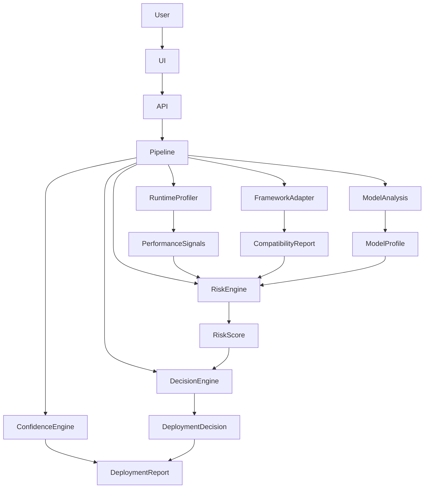
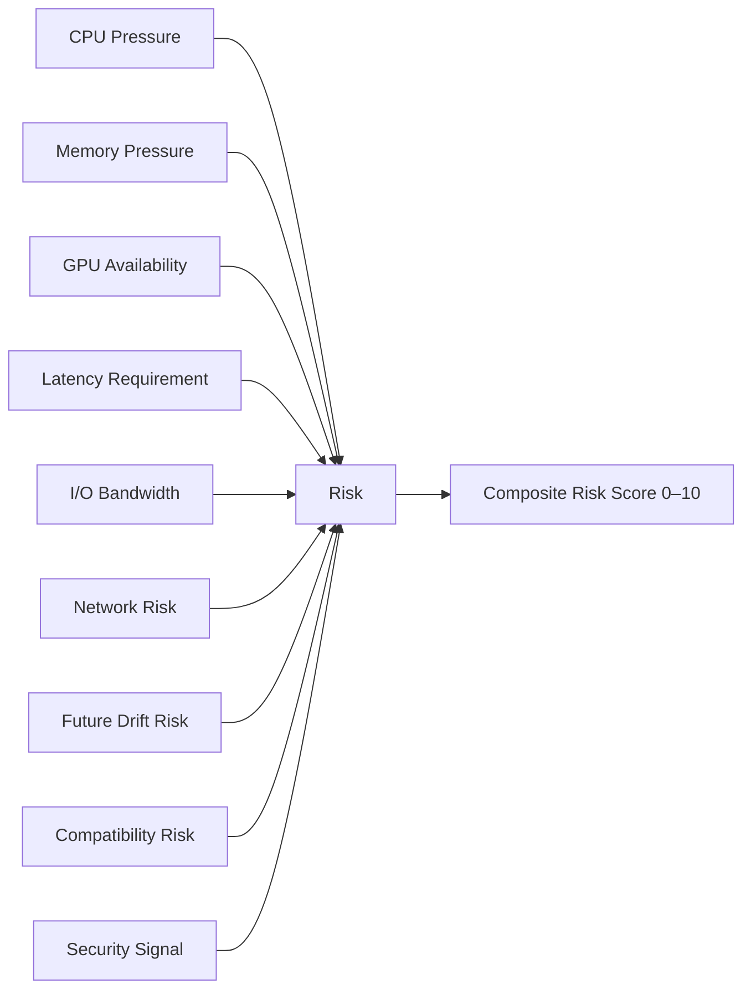
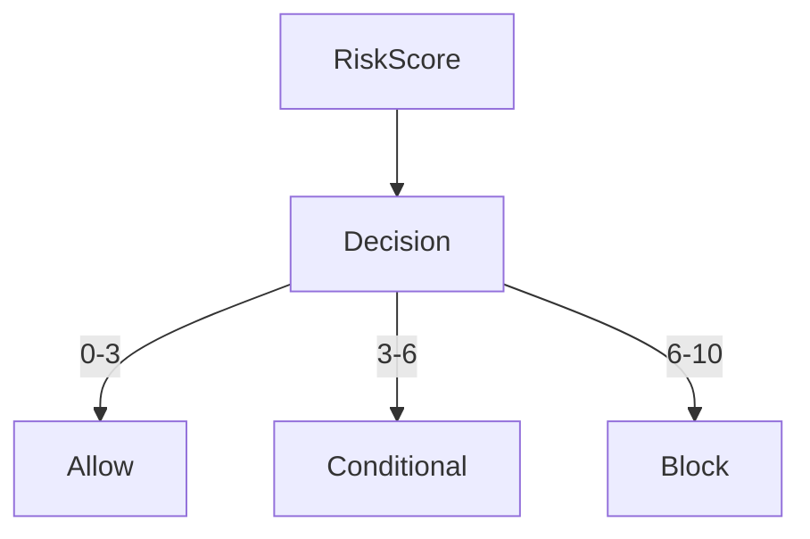

# AI Deployment Decision Engine

> AI infrastructure system that evaluates whether machine learning models can safely deploy on a target hardware environment using runtime simulation and risk scoring.

## System Overview


The AI Deployment Decision Engine starts processing when a User or API Client submits a model via the Web UI to the FastAPI Backend. The Model Analysis Engine parses the model architecture and forwards the properties into the Runtime Profiler to simulate constrained hardware limits locally. These dynamic performance metrics alongside strict framework compatibility validations are immediately aggregated by the Risk Engine, which ultimately quantifies safe deployment margins. Finally, the Decision Layer evaluates this composite risk score and structurally commits an actionable final Deployment Report.

## Key Features

- **Hardware-Aware Profiling:** Intelligently simulates ML model runtime limits across specifically designated target compute architectures.
- **Real-Time Risk Scoring:** Natively aggregates multiple critical dimensions—including latency pressure, memory density, and raw hardware tier—into a core deterministic score metric.
- **Automated Decision Gatekeeper:** Executes powerful threshold-based policy governance seamlessly determining whether to accept, provisionally limit, or totally block system deployments.
- **Deep Compatibility Integrity:** Rigorously verifies structural matrix bounds mapped accurately to key ML framework ecosystems such as PyTorch, ONNX, and TensorRT processing targets.
- **State-Safe Execution Pipeline:** Employs entirely thread-safe evaluation components, ensuring concurrent user analytics safely operate completely unhindered by parallel state bleeding.
- **Deterministic SLA Controls:** Employs dynamically scaling boundaries protecting main operational systems against silent Over-Memory errors or dangerous production inference crashes.

## Full System Architecture



The system is rigorously isolated into discrete functional execution layers designed entirely to ensure secure calculation safety. The external API interfaces drive user tasks into an orchestrated asynchronous system Pipeline functioning without architectural cross-locking barriers. From here, independent analytical services simultaneously gather structural target conditions including active model footprints, local node performance limits, and framework deployment integrity limits. Information streams synchronously converge inside the advanced Risk Engine layers where arrayed diagnostic evaluations generate a continuous global Risk Score rating. Concurrently, the final Decision Engine matches the rating index heavily against designated hardware SLAs, while the underlying Confidence Engine continuously verifies assessment transparency, cleanly uniting into a robust Deployment Report. 

## Risk Scoring Model



The underlying Risk Engine deploys a complex dynamically-weighted signal aggregation map reducing multidimensional stress bounds specifically into a final scalar metric indexed securely from `0.0` (optimal) to `10.0` (failing). Concrete operational deficiencies including immense Memory Pressure or broken Target GPU Availability natively command massive multiplier priorities immediately applying drastic composite score escalations. Meanwhile, softer telemetry limitations dealing with local Network Risk or potential execution drift evenly penalize the engine according precisely relative to configurable platform tolerance parameters, producing an ultimately refined unified evaluation rating. 

## Decision System



The policy mechanism inside the Decision Layer definitively enforces unyielding gateway safety based explicitly on internal scoring map vectors resolved inside the engine bounds. Composite risk scores computed between exactly 0 and 3 natively pass execution protocols certifying perfectly normalized operations. A boundary measurement returning 3 sequentially up through 6 categorizes as a clear 'Conditional' rating, forcefully communicating potential minor SLA degradations possibly demanding manual review. Ultimately, workloads triggering high-risk bands between 6 and 10 forcefully crash out entirely via automated system Block policies proactively guarding downstream datacenter integrity limits against critical crash thresholds.

## Hardware Tiers

| Hardware Tier | Core Infrastructure Profile | VRAM Parameters | Critical SLA Target |
| :--- | :--- | :--- | :--- |
| **EDGE** | Low-power optimized SOC nodes, local constrained devices | `≤ 4GB` | `< 500ms` |
| **STANDARD** | General-purpose cloud clusters, basic baseline network nodes | `8GB - 16GB` | `< 200ms` |
| **PRODUCTION** | Premium real-time endpoints, dedicated accelerator nodes | `24GB - 48GB` | `< 50ms` |
| **HPC** | Matrix-parallel superclusters, massive unified framework models | `80GB+` | `< 10ms` |

## Project Structure

```text
deployment_decision_engine/
├── src/
│   ├── api/             # FastAPI protocol boundaries
│   ├── cli/             # Target command-line entry layers
│   ├── core/            # System data schema and central pipeline algorithms  
│   ├── diagnostics/     # Application profilers and hardware inspectors
│   ├── gui/             # Dashboard user interface views
│   ├── rules/           # Fixed risk parameter weight limits
│   └── validation/      # Target metrics and evaluation experiment invariants
<<<<<<< HEAD
=======
├── experiments/         # Evaluation state testing vectors
├── quarantine/          # Blocked staging cache logic loops
├── models/              # Local dataset parameter file states
├── scripts/             # Internal operation helper components
>>>>>>> 981183b7c0bb6f208d16f0ea2601f65178eb7cb3
├── main.py              # CLI subsystem initialization target 
├── gui_app.py           # Core web dashboard runtime script
└── requirements.txt     # Python ecosystem network dependency configuration
```

## Running the System

```bash
pip install -r requirements.txt
uvicorn gui_app:app --host 127.0.0.1 --port 8080
```

## UI Screenshots

### Dashboard


### Model Upload


### Hardware Configuration


### Analysis Results


## Validation System

The total infrastructure enforces a hyper-vigilant automated experiment validation matrix structured essentially to continuously audit calculation resilience specifically during rapid concurrent loading scenarios:

- **Determinism:** The pipeline asserts robust verification constraints confirming consistently that identical uploaded execution models processing exactly identical local hardware target tiers strictly compute totally invariant metric results naturally free of dynamic score drift elements.
- **Concurrency Safety:** Core system memory structures evaluate entirely safe for thread overlap. Massive batch deployment jobs naturally parallelize locally without any hidden variable bleed or structural configuration corruption happening dynamically. 
- **Risk Scaling Verification:** Sub-component tests formally enforce risk parameter outputs tracking directly against stress limits efficiently dynamically shifting exponentially upward identically scaling exactly against escalating memory/latency bounds crossing target SLA maximums.  
- **Confidence Variation:** The `ConfidenceEngine` natively monitors external inference components seamlessly decaying internal confidence score multipliers precisely against ambiguous models successfully ensuring unverified framework parameter gaps fundamentally trip deployment failure conditions strictly prior to reaching network.

## License

Copyright © 2026 AI Deployment Decision Engine. All Rights Reserved.
