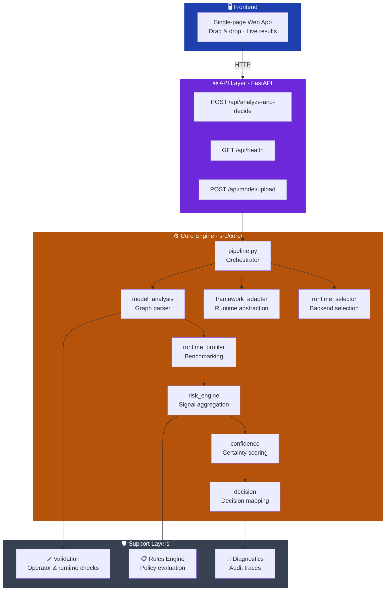
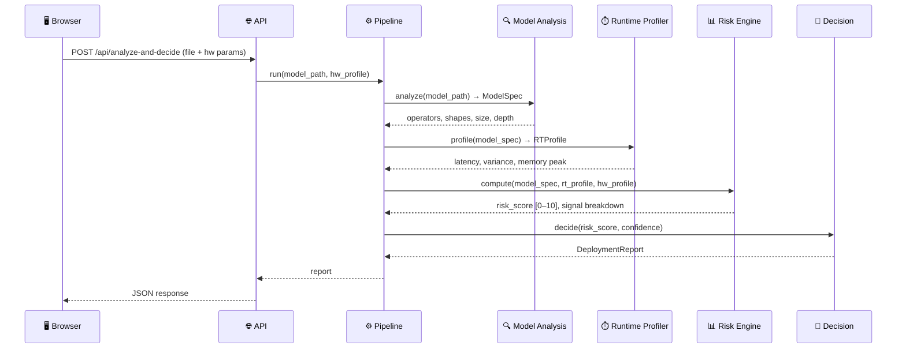
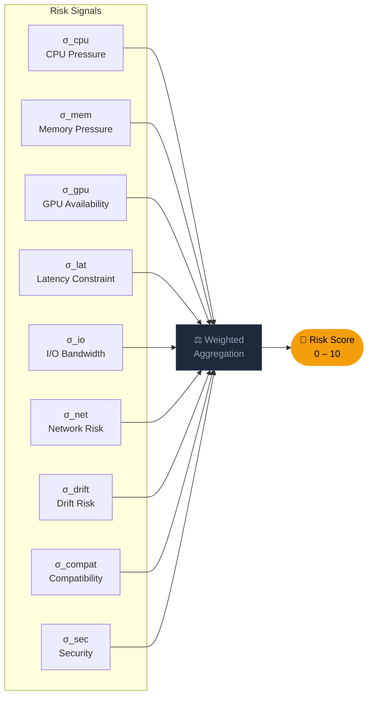
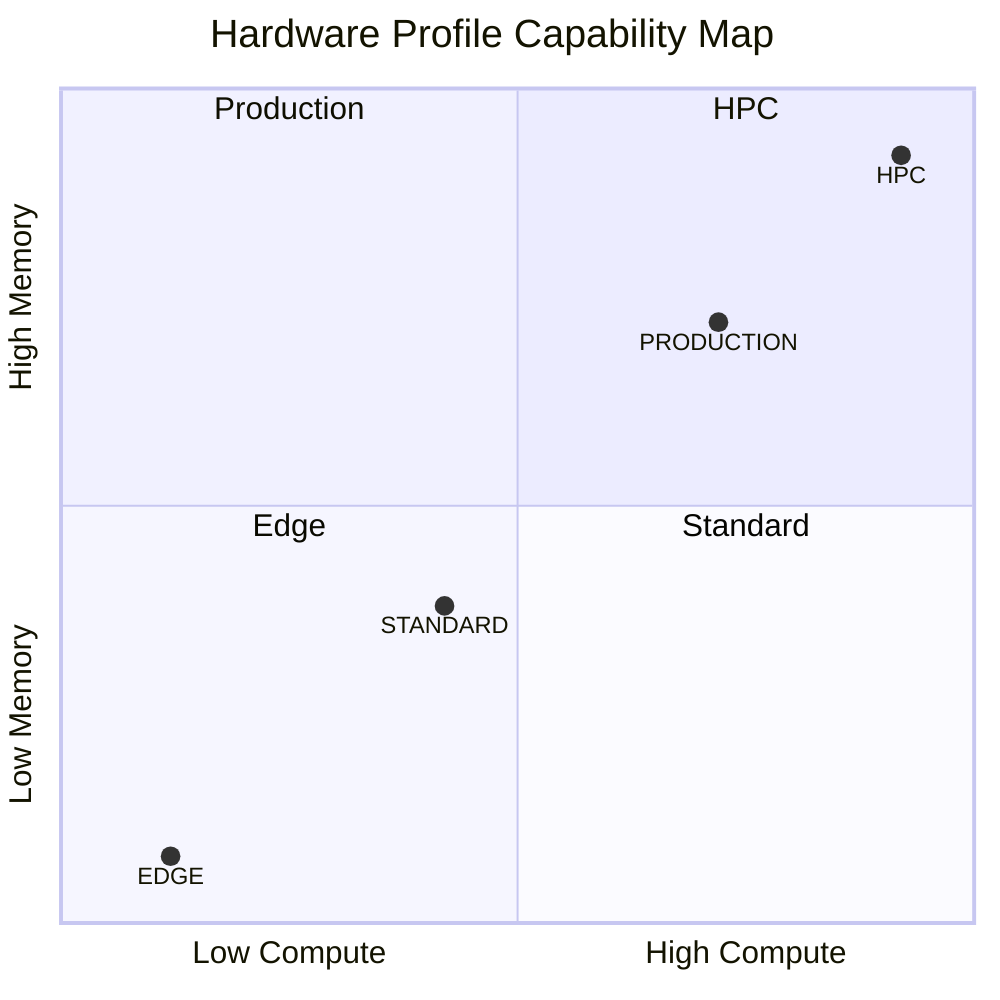
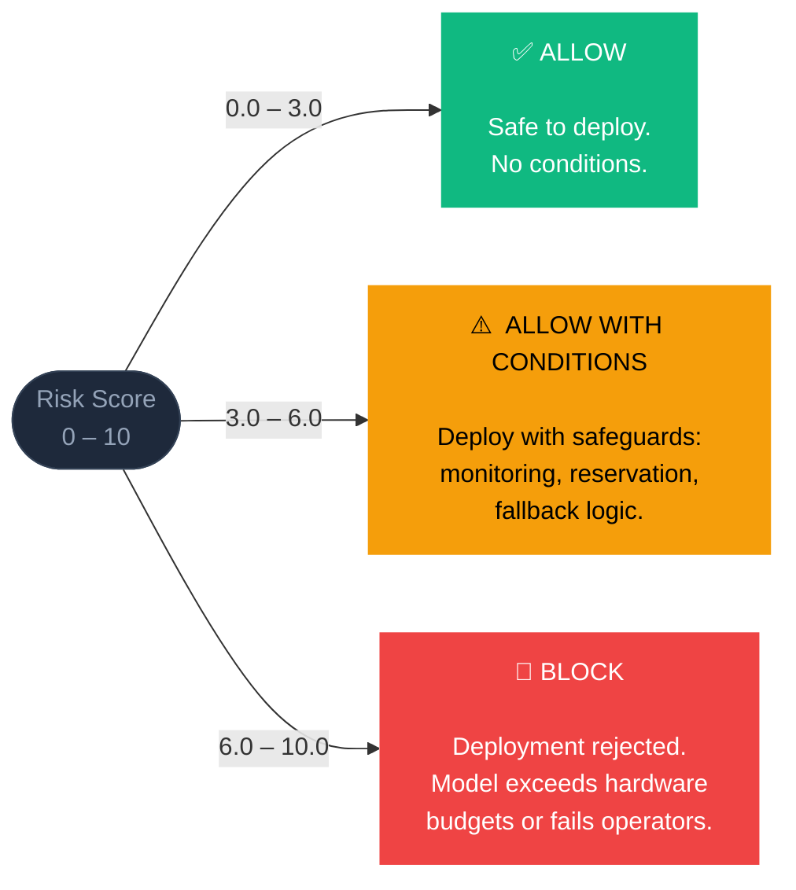
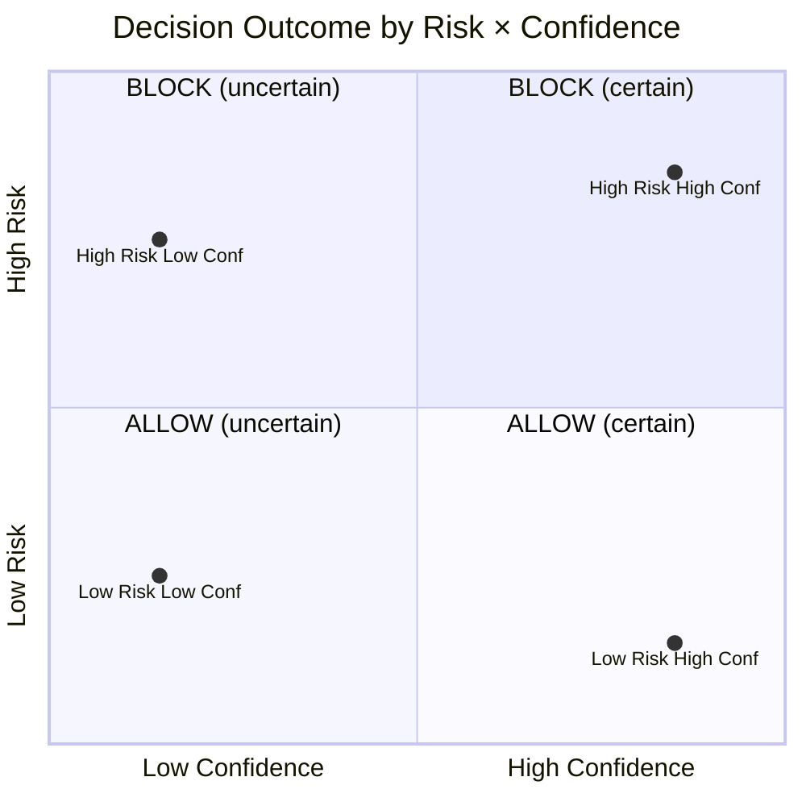
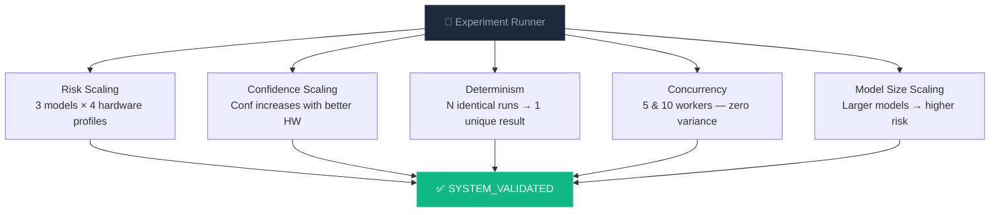

# 🚀 AI Deployment Decision Engine

© 2026 Omar Nady — All Rights Reserved

This repository is published for portfolio demonstration purposes only.

Unauthorized commercial use, redistribution, or derivative work is prohibited.

> **Before your ML model touches production — know exactly if it will survive.**

Upload an ONNX model, pick a hardware target, and get a deterministic **ALLOW / ALLOW WITH CONDITIONS / BLOCK** verdict backed by a 9-signal risk score, confidence estimate, and full audit trace.

---

## ⚡ Quick Start

```bash
# Install
pip install -e .

# Launch the web UI
python main.py --gui
```

Open **http://127.0.0.1:8080** — upload a model, select hardware, analyze.

```bash
# Other launch modes
python main.py --gui --port 9000          # custom port
python main.py --cli models/mnist-8.onnx  # terminal only

# Raw server
python -m uvicorn gui_app:app --host 127.0.0.1 --port 8080
```

**API:**
```bash
curl -X POST http://localhost:8080/api/analyze-and-decide \
  -F "file=@models/resnet50-v2-7.onnx" \
  -F "cpu_cores=8" -F "ram_gb=16" -F "gpu_available=true"
```

---

## 📋 Table of Contents

- [How It Works](#how-it-works)
- [Architecture](#architecture)
- [Risk Model](#risk-model)
- [Hardware Profiles](#hardware-profiles)
- [Decision System](#decision-system)
- [Key Features](#key-features)
- [Project Structure](#project-structure)
- [Experiment & Validation](#experiment--validation)
- [Future Work](#future-work)

---

## 🔍 How It Works

Every analysis request runs a six-step deterministic pipeline:


| Step | What Happens |
|------|-------------|
| **Model Parsing** | Deserializes the ONNX protobuf graph |
| **Operator Analysis** | Extracts operators, checks hardware compatibility, scores complexity |
| **Runtime Profiling** | Benchmarks execution — latency, variance, memory peak, throughput |
| **Hardware Simulation** | Applies target constraints (memory ceiling, compute budget, I/O) |
| **Risk Computation** | Evaluates 9 independent risk signals |
| **Decision Aggregation** | Combines signals into 0–10 risk score → deployment decision + confidence |

**Core guarantees:**

| Principle | Meaning |
|-----------|---------|
| **Deterministic** | Same input → same output, always |
| **Explainable** | Every decision includes a full signal breakdown |
| **Stateless** | Each analysis is fully isolated |
| **Concurrent** | Safe for parallel API requests |

---

## 🏗️ Architecture



### Layers at a glance

| Layer | Path | Role |
|-------|------|------|
| **Frontend** | `src/gui/static/` | Browser UI — upload, configure, view results |
| **API** | `src/api/` | HTTP endpoints, validation, multipart upload, JSON |
| **Core Engine** | `src/core/` | Full risk pipeline, model analysis, profiling, decisions |
| **Validation** | `src/validation/` | Operator compatibility, runtime feasibility checks |
| **Rules** | `src/rules/` | Declarative deployment policies (extensible) |
| **Diagnostics** | `src/diagnostics/` | Human-readable audit traces on every decision |

### Pipeline internals



---

## 📊 Risk Model

The engine computes **9 independent risk signals**, each normalized to [0, 1], then aggregates into a scalar score on a **0–10 scale**.



### Signal weights

| Signal | Weight | Why it matters |
|--------|--------|---------------|
| CPU Pressure | 1.5 | Sustained CPU overload causes latency spikes |
| **Memory Pressure** | **2.0** | OOM kills inference instantly |
| GPU Availability | 1.0 | Missing GPU backend blocks execution |
| **Latency Constraint** | **2.0** | SLA violations are immediate failures |
| I/O Bandwidth | 1.0 | Bottleneck for large batch sizes |
| Network Risk | 0.5 | Secondary concern for most deployments |
| Drift Risk | 0.5 | Long-term stability indicator |
| **Compatibility** | **2.5** | Unsupported operators = runtime crash |
| Security | 1.5 | Unsafe ops expose the host system |

```
risk_score = ( Σ signal_i × weight_i ) / ( Σ weight_i ) × 10
```

---

## 🖥️ Hardware Profiles



| Profile | CPU | RAM | GPU | Latency Budget | Typical Hardware |
|---------|-----|-----|-----|---------------|-----------------|
| 🟢 **EDGE** | 2 cores | 512 MB | None | 100 ms | Raspberry Pi 4, Jetson Nano |
| 🔵 **STANDARD** | 8 cores | 8 GB | Optional | 500 ms | AWS c5.2xlarge, dev workstation |
| 🟠 **PRODUCTION** | 32 cores | 64 GB | Required | 50 ms | AWS p3.2xlarge, A100 instance |
| 🔴 **HPC** | 128+ cores | 512 GB | Multi-GPU | Unconstrained | DGX A100, HPC clusters |

> The engine doesn't just check minimum requirements — it evaluates **operational margin**. A model using 90% of available RAM technically fits, but gets an elevated memory pressure signal because the margin is too thin for production reliability.

---

## 🎯 Decision System

### Risk → Decision mapping



### Conditions generated (ALLOW WITH CONDITIONS)

When a signal is elevated, specific operational conditions are attached:

| Elevated Signal | Condition |
|----------------|-----------|
| Memory > 0.5 | Reserve dedicated memory. Disable co-located processes. |
| Latency > 0.5 | Enable latency monitoring. Alert at 80% of budget. |
| CPU > 0.5 | Pin to reserved cores. Disable frequency scaling. |
| Compatibility > 0.3 | Validate operators on target device pre-release. |
| Drift > 0.4 | Re-evaluate model within 90 days. |

### Confidence



### Example response

```json
{
  "decision": "ALLOW_WITH_CONDITIONS",
  "risk_score": 4.72,
  "confidence": 0.83,
  "risk_level": "MEDIUM_RISK",
  "signals": {
    "cpu_pressure":      0.41,
    "memory_pressure":   0.63,
    "gpu_availability":  0.00,
    "latency_constraint": 0.55,
    "io_bandwidth":      0.21,
    "network_risk":      0.05,
    "drift_risk":        0.18,
    "compatibility_risk": 0.09,
    "security_signal":   0.00
  },
  "conditions": [
    "Ensure dedicated memory reservation.",
    "Enable latency monitoring at 80% threshold."
  ],
  "hw_profile": "PRODUCTION"
}
```

---

## ✨ Key Features

| Feature | Description |
|---------|-------------|
| 🔍 **Model Analysis** | Full ONNX graph inspection — operators, shapes, depth, parameters |
| ⏱️ **Runtime Profiling** | Live benchmarking with latency and memory measurement |
| 🖥️ **Hardware Simulation** | Profile-based constraint evaluation across 4 tiers |
| 📊 **Risk Scoring** | 9-signal weighted aggregation → scalar 0–10 score |
| 🎯 **Decision Engine** | ALLOW / CONDITIONS / BLOCK with conditions and rationale |
| 🔒 **Confidence Estimation** | Quantified certainty attached to every decision |
| 📋 **Explainability** | Full signal breakdown — see exactly why a decision was made |
| ⚡ **Deterministic** | Identical inputs → identical outputs, every time |
| 🔄 **Concurrency-Safe** | Stateless API safe for parallel analysis |
| 📝 **Audit Traces** | Every analysis produces an archivable diagnostic trace |
| 🧩 **Extensible Rules** | Add deployment policies without touching engine logic |

---

## 📁 Project Structure

```
deployment_decision_engine/
│
├── gui_app.py               # Server entry point (uvicorn shim)
├── main.py                  # Multi-mode launcher (--gui / --cli / --api)
├── pyproject.toml           # Dependencies & project config
├── README.md
│
├── src/
│   ├── api/                 # HTTP layer
│   │   ├── gui_app.py       # FastAPI application
│   │   ├── gui_routes.py    # Route definitions
│   │   ├── gui_analysis_api.py
│   │   ├── gui_calibration_api.py
│   │   ├── gui_decision_api.py
│   │   └── gui_state_api.py
│   │
│   ├── core/                # Engine logic (~45 modules)
│   │   ├── pipeline.py              # Orchestrator
│   │   ├── model_analysis.py        # ONNX graph parser
│   │   ├── runtime_profiler.py      # Benchmarking
│   │   ├── risk_engine.py           # Signal aggregation
│   │   ├── confidence.py            # Confidence scoring
│   │   ├── decision.py              # Risk → decision mapping
│   │   ├── framework_adapter.py     # Runtime abstraction
│   │   ├── runtime_selector.py      # Backend selection
│   │   └── ...                      # Calibration, persistence, GPU
│   │
│   ├── validation/          # Operator & runtime checks
│   ├── diagnostics/         # Audit trace generation
│   ├── rules/               # Declarative deployment policies
│   ├── cli/                 # Command-line interface
│   └── gui/static/          # Frontend — HTML, JS, CSS
│
├── models/                  # Test ONNX models
│   ├── mnist-8.onnx         # 26 KB  — small CNN
│   ├── yolov5s.onnx         # 28 MB  — object detection
│   └── resnet50-v2-7.onnx   # 98 MB  — image classification
│
├── experiments/             # Validation scripts & reports
│   ├── run_experiment.py    # Full experiment runner
│   └── *.json / *.md        # Results & reports
│
├── scripts/                 # Helper utilities
└── quarantine/              # Archived legacy files
```

---

## 🧪 Experiment & Validation

### Run the full experiment suite

```bash
python experiments/run_experiment.py
```

### Validation tests



| Test | Pass Criteria |
|------|--------------|
| **Risk Scaling** | Risk decreases monotonically EDGE → HPC |
| **Confidence Scaling** | Conf(HPC) ≥ Conf(PROD) ≥ Conf(STANDARD) ≥ Conf(EDGE) |
| **Determinism** | All repeated runs produce identical (risk, decision) |
| **Concurrency** | All concurrent results match baseline |
| **Model Size Scaling** | Risk grows with model complexity |

### Validated results (real data)

| Model | Profile | Decision | Risk | Confidence |
|-------|---------|----------|------|------------|
| mnist-8 (26 KB) | EDGE | APPROVED | 7.52 | 0.59 |
| mnist-8 (26 KB) | STANDARD | APPROVED | 4.11 | 0.87 |
| mnist-8 (26 KB) | HPC | APPROVED | 2.81 | 0.95 |
| yolov5s (28 MB) | STANDARD | APPROVED | 4.11 | 0.87 |
| resnet50 (98 MB) | EDGE | REJECTED | 7.52 | 0.59 |
| resnet50 (98 MB) | HPC | APPROVED | 2.81 | 0.95 |

---

## 🔮 Future Work

```mermaid
roadmap
    title Planned Features
    section Model Formats
        TensorFlow SavedModel / TFLite  : done, a1
        PyTorch TorchScript             : active, a2
        CoreML (Apple Silicon)          : a3
    section Profiling
        GPU benchmarking (CUDA)         : active, b1
        TensorRT simulation             : b2
    section UX
        Hardware autodetection          : c1
        CI/CD GitHub Action integration : c2
    section Cloud
        AWS SageMaker policies          : d1
        GCP Vertex AI constraints       : d2
        Azure ML limits                 : d3
    section Scale
        Multi-node readiness            : e1
        Tensor parallelism support      : e2
```

---

## 📄 License

MIT License. See `LICENSE` for details.

## 🤝 Contributing

Open an issue before submitting PRs for significant changes. New risk signals, rules, and hardware profiles must include tests.

---

*AI Deployment Decision Engine — deterministic, explainable, production-ready.*
